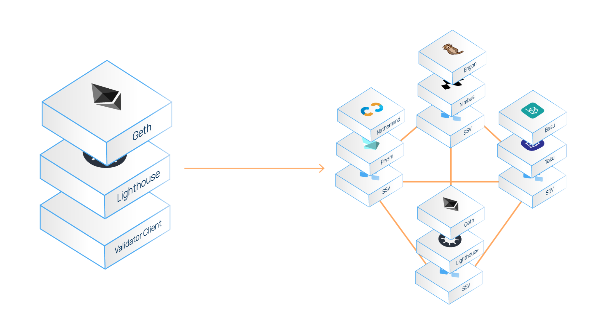
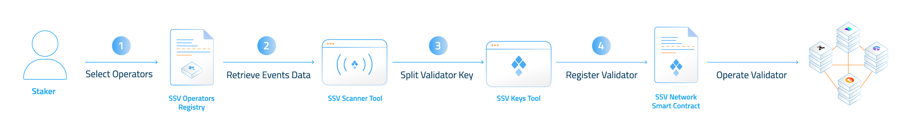
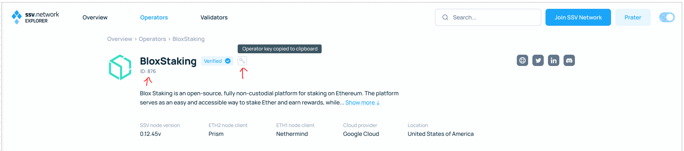

# Run a Distributed Validator

The SSV network enables the distribution of validator operations between non-trusting operators.


In order to distribute your validator, you must have an activated (deposited) validator on the Beacon Chain.


## How to Run a Distributed Validator 

This guide outlines the steps required to run a distributed validator via the ssv.network, using the protocol’s smart contracts and developer tools.

### Prerequisites 

* **An Ethereum validator** - generation of validator keys and their activation (deposit) to the Beacon Chain could be done using Ethereum’s official [Staking Deposit CLI](https://github.com/ethereum/staking-deposit-cli) and their [Launchpad](https://goerli.launchpad.ethereum.org/).
* **Goerli ETH** (<0.1) to cover transaction gas costs on the Goerli testnet (Community members on our [discord](https://discord.gg/D5kUdV93) could assist in obtaining the required amount).
* **Testnet SSV** ([faucet](https://faucet.ssv.network/))

### Process Overview 

Validators are managed within Clusters - the group of operators that were selected to operate them.

Running a distributed validator is outlined by the following steps:

1. Select the group of operators to manage your validator.
2. Retrieve events data for your account and cluster
3. Split your validator key to shares.
4. Register your validator to the network.

<figure><figcaption>
<em>Process Diagram</em>
</figcaption></figure>

<figure><figcaption>
Process Overview
</figcaption></figure>

#### 1. Operator Selection 

Select your preferred group of operators from the operator registry of the SSV network.

The number of cluster operators you select must be **3f+1** compatible, whereas **f** is the number of faulty operators that your cluster could endure (more operators, greater fault tolerance)  - e.g. 4, 7, 10, 13.

For each chosen operator, you must fetch its network assigned **id** and its corresponding **key**.

The entire operator registry can be viewed via the ssv.network’s [explorer](https://explorer.ssv.network/operators) or through the SSV API to get access to the necessary operator **ids / keys**.

#### 2. Retrieve Events Data 

The SSV developer tools and smart contracts transactions require off-chain state inputs for operation and security.

Use the [SSV Scanner](https://ssv-network.gitbook.io/docs-v4/tools/ssv-scanner) tools to retrieve the latest **registration nonce** and **cluster snapshot** for your account and validator cluster - they will both be required as inputs for the next step.


Please note that as your **registration nonce** and **cluster snapshot** data updates after each transaction with cluster related functions, it’s required to fetch them before each validator registration.


#### 3. Split Validator Key to Shares 

To assign the validator operation to the cluster of your selected operators, you must split your validator key to shares.

Use the [SSV Keys](tools/ssv-keys/) tool to extract your validator key from your keystore file and split it to shares.

#### 4. Network Registration 

To signal your cluster to start operating your validator, you must register your validator to the network by broadcasting the [registerValidator()](smart-contracts/smart-contracts/ssvnetwork.md#public-registervalidator-publickey-operatorids-shares-amount-cluster) transaction to the ssv.network contract:

<table><thead><tr><th width="136.33333333333331">Parameter</th><th width="114">Type</th><th>Description</th></tr></thead><tbody><tr><td>publicKey</td><td>bytes</td><td>The validator’s public key.</td></tr><tr><td>operatorIds</td><td>uint64[]</td><td>List of all operator’s ids which were selected during the <a href="README (1).md#_tulnbjthau7t">“Operators Selection”</a> step.</td></tr><tr><td>sharesData</td><td>bytes[]</td><td>sharesData which were produced during the “<a href="README (1).md#_x02jw9rs53s3-1">Key Splitting</a>” step - obtained using the <a href="tools/ssv-keys/">SSV Keys</a> tool.</td></tr><tr><td>amount</td><td>uint256</td><td>Amount of SSV tokens to be deposited as payment (not mandatory). See <a href="https://docs.ssv.network/learn/stakers#validator-funding">validator funding</a> to calculate how much funding is needed to run each validator.</td></tr><tr><td>cluster</td><td>tuple[]</td><td>Object containing the latest cluster snapshot data, produced during the “Retrieve Events Data” step - obtained using the <a href="tools/ssv-scanner/">SSV Scanne</a><a href="tools/ssv-scanner/">r</a> tool.  <strong>If this is the 1st validator within a specific cluster (unique set of operators), use - {0,0,0,true,0}</strong></td></tr></tbody></table>

You can construct the transaction by yourself or through using the partial payload generated by the [SSV Keys](tools/ssv-keys/) tool used in the “Key Splitting” step.


Please note that as SSV is deposited to the contract, you must initially approve the SSV contract address to spend your SSV tokens prior to the registration transaction.

